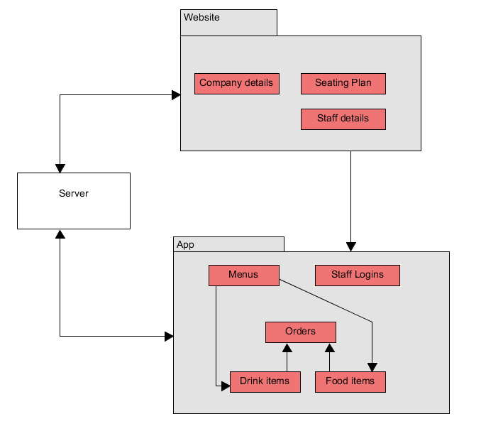
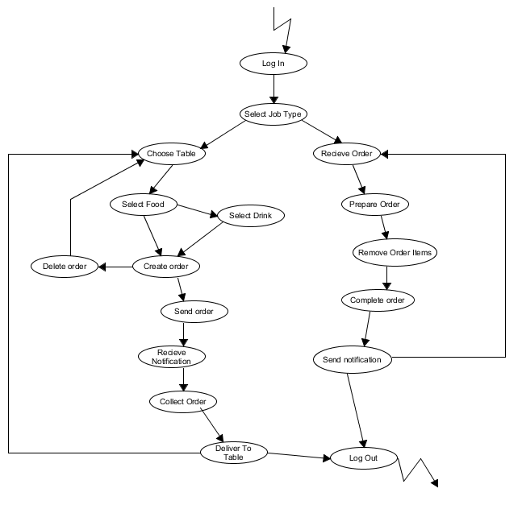
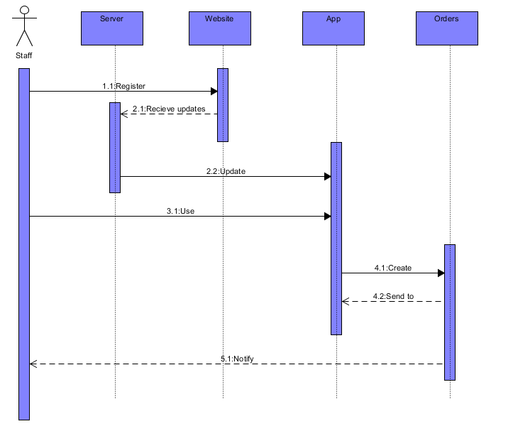
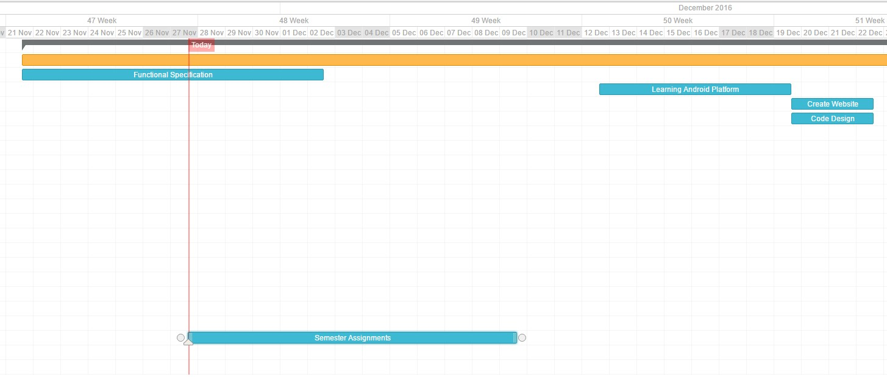
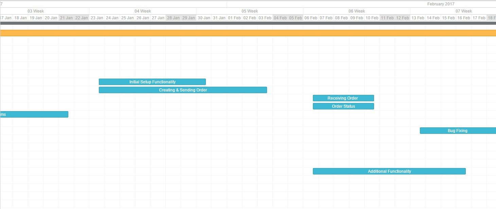
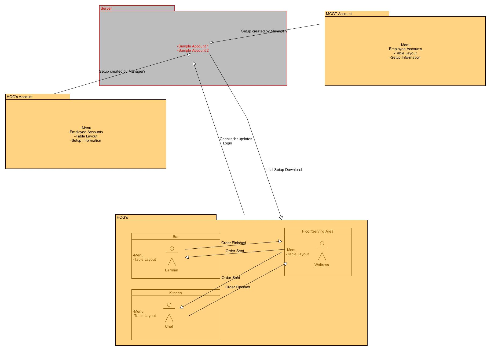

# 3rd Year Project Functional Specification

Date:               
* 30th November 2016
 
Student Names:      
* Finnian O’Neill 
* Ian Kelly

Lecturer:           
* Dr.David Sinclair

Topics:             
1. Introduction. 
2. General Description 
3. Functional Requirements 
4. System Architecture 
5. High-Level Design 
6. Preliminary Schedule
7. Appendices

We declare that this material, which We now submit for assessment, is entirely our own work and has not been taken from the work of others, save and to the extent that such work has been cited and acknowledged within the text of my/our work. We understand that plagiarism, collusion, and copying are grave and serious offences in the university and accept the penalties that would be imposed should we engage in plagiarism, collusion or copying. We have read and understood the Assignment Regulations. We have identified and included the source of all facts, ideas, opinions, and viewpoints of others in the assignment references. Direct quotations from books, journal articles, Internet sources, module text, or any other source whatsoever are acknowledged and the source cited are identified in the assignment references. This assignment, or any part of it, has not been previously submitted by us or any other person for assessment on this or any other course of study. We have read and understood the referencing guidelines found at: http://www.dcu.ie/info/regulations/plagiarism.shtml 

-------------------------------------------------------------------------------

## Introduction

### Overview

For our project we are going to design and develop a Point of Sale application aimed at small to medium businesses. We see a need for our app as many businesses are beginning to use tablets as an alternative for tills as they are more cost effective in comparison to regular tills that require a great deal of setup with little reward. 

We aim to design a point of sale application that will be targeted specifically at Bars, Restaurants and Cafes so that we can increase efficiency and productivity during service as we feel current solutions do not allow you to tailor your POS device to the needs of your business. 

Our application will be designed for the Android platform and it will allow a waiter/waitress to take an order on her android phone, then once she is finished taking the order it will be divided up and sent to various parts of the restaurant, for example the drinks will be sent to the Bar and the food will be sent to the kitchen.  

### Business Context

The aim for this project is to provide an alternative option for current POS services with something that is tailored to the needs of your business allowing for a more efficient and productive service which in turn should increase sales.

The app will also have great scope for analytics and will allow the owner to determine where the inefficiencies lie in their business.

### Glossary

POS - Point of Sale/Service 

-------------------------------------------------------------------------------

## General Description

### Product / System Functions

The application will have two forms: the android application and the web application. The web application’s purpose is solely for the initial setup and registration by a business. The business is registered to the site, presumably by a manager. The user will then have the option to create the setup for the android devices which will include the addition of menu items, the restaurant seating plan, and the addition or removal of staff member profiles. Any changes to these items will require an update for the android devices.
Once the setup is complete, staff members can use their android phone or tablet to log into their newly-created accounts. This will download all of the information from the site for their use during work hours. In use, the waiter or waitress will take an order from a customer and select their requested items from the menu on the phone along with when they are seated. The order will then be broken into two categories, food and drink, and each category sent to their respective device over the network. The food items will be sent to a device in the bar and the food items will be sent to a device in the kitchen.

Once these items are received, they can be sorted and ordered to manage what has been made and what has yet to be made. For example, the items sent to the kitchen can be ordered into starters, mains, and desserts. Once the starters are finished, those items can be removed from the list to make room for the mains. A notification is then sent back to the waiter/waitress to notify them that food is ready to be collected. The items in the bar work in a similar manner in which once a drink is prepared it can be removed from the list. Once the list is empty a notification is sent out to indicate they are ready to be collected.

The user interface of the app will be relatively simplistic in design. When the app is opened, the user will be faced with a login screen where they enter their credentials. Once logged, there will be a menu screen when they select which area where they work, which will be ‘floor’, ‘bar’, or ‘kitchen’. Depending on which they choose they are given different option. 

For the floor they are able to create orders, view the seating plan and assign customers to certain tables, and they can view the tab for every table. When creating an order they are given a list of the categories for different food types created from the Website. They simply tap items to add them to the order along with an option to remove them. Floor staff are also given a notification for when an order is complete

The bar has similar functions to the floor however they can only create orders for drinks. They are given an additional tab at the menu for orders they have received. They can tap items on the order to indicate that are made. Once all items have been tapped the order is removed.

The kitchen can only receive orders and select items when they are finished however they do have additional options to manage the different courses separately.

All devices receive a notification when something has been changed to the items on the Website and will be prompted to update their device to accommodate these changes. Updates are automatic when logging in.

### User Characteristics and Objectives

The bar and restaurant industry attracts all kinds of people of different ages and genders with varying technical knowledge. Working in a restaurant can be a full time or part time job and may even be someone’s first job. This means that the age range of users can by anywhere from 16 to 65 years of age. This means that the Website and the android app must be both accessible and simple to navigate. This will involve ensuring that the app colour palette is suitable and the text and buttons large and visible for those that may have poor vision. Icons and text must also be unambiguous in their function for less tech savvy users. These features will ensure that the app is easy to use by everyone in a busy work environment.

### Operational Scenarios

##### Registering the company 
***Precondition*** ---  The company has not already set up an account on the Website.

***Activation*** --- The company member who is registering goes to the app's Website.

***Description :***  
* The user click 'Register' on the site's homepage. 
* They enter the company's information.
* They select 'Seating Plan' and create tables with numbers in ascending order.
* They select 'Add/remove Staff' and enter staff details. 
* The select 'Select network' and choose their network. 

***Termination*** --- All changes are saved and the user leaves the site. 

##### Logging in 

***Precondition*** --- The staff member has arrived at work and is not logged in to the app.

***Activation*** --- The staff member has opened the app.

***Description :*** 
* They enter their username and password. 
* The hit 'Enter'.

***Termination*** --- The staff member gains access to the app.

##### Creating an order 

***Precondition*** --- The staff member has logged into the app. 

***Activation*** --- A customer has decided to order a meal and drink.

***Description :***  
* The staff member selects whether they are bar or floor staff 
* They select food 
* They choose a course (Starter, main, dessert). 
* They select a category of meal. 
* They scroll down to find the meal and add it to the order list.
* They back out and select drink.
* They select a category of drink.
* They scroll down to find the beverage and add it to the order list.

***Termination*** --- The order is finished and has been sent over the network.

##### Receiving an order 

***Precondition*** --- The staff member has logged into the app.

***Activation*** --- Another staff member has created and sent an order. 

***Description :***
* The user receives a notification on their app of an incoming order.
* They select on 'Orders' on their menu and select the new order.
* They choose an item on the order and make it/get it. 
* They tap that item from the list to indicate it is ready.
* When all items are ready the order is removed. 

***Termination*** --- The floor staff have been notified that the order is ready for collection. 

### Constraints

* The first constraint is that this is an android app and that the user will require and android device. The app will not be available on any other platform.
* The user will be required to remember their login information
* The app may lose Internet connection or crash. This means that the app must save orders and work offline.
* The user’s battery may die. This means that the user cannot create orders or use other app function from this phone until its recharged. This may cause a serious issue if the restaurant is busy and will affect efficiency.
* The app needs to be simple to use and fast in order to keep up with a busy work environment. Mistakes must also be easily undone.The first constraint is that this is an android app and that the user will require and android device. The app will not be available on any other platform.
* The user will be required to remember their login information
* The app may lose Internet connection or crash. This means that the app must save orders and work offline.
* The user’s battery may die. This means that the user cannot create orders or use other app function from this phone until its recharged. This may cause a serious issue if the restaurant is busy and will affect efficiency.
* The app needs to be simple to use and fast in order to keep up with a busy work environment. Mistakes must also be easily undone.

-------------------------------------------------------------------------------

## Functional Requirements

### Registration
 
###### Description
The user should be able to create a Menu, add Employee's(and generate Logins for each), create a table map and select a LAN network all through our Website.
 
###### Criticality
This is a vital part of the system as it is the initial one time setup to start the system.
 
###### Technical issues
One implementation issue could be getting hold of a server to be able to run the application.
 
Also selecting the LAN network as if the user is not on the network they want the application to run on, they will have to add it to their initial setup which could be confusing for users who are not tech savvy.
 
###### Dependencies with other requirements
This function does not rely on any other functions.
 
### Initial Setup
 
###### Description
The first time a user downloads the android application they will be required to login and must be on the selected LAN network, after which a local copy of all the required files will be created. 
 
###### Criticality
This is a vital part of the system as it will double as the security restrictions for use of the application and also it will allow for offline functionality.
 
###### Technical issues
One issue could be that for a medium business the local copy of the required files could be large and may be an issue for some users. 
 
###### Dependencies with other requirements
This function will rely on the registration requirement as it will have to find which account the login is related to. 
 
### Daily initial connection
 
###### Description
If an employee leaves or quits they will need to be taken off the system to ensure they still can't create orders,if there is an update to the menu or if there is a change to the table map. So a small sync the first time you connect to the LAN each day it will check for any changes made to the system and update. This will also be possible through an update button.
 
###### Criticality
This is a will be a necessary function to allow changes to be made without affecting service.
 
###### Technical issues
One issue could be that some android devices only connect to LAN networks once they're awake and could mean that a user may have to wait if a significant amount of changes were made to the system.
 
###### Dependencies with other requirements
This function will rely on the registration requirement as it will have to find which account the login is related to and if any changes were made to that account. 
 
### Sending an Order
 
###### Description
A waitress/waiter will take down an order and send it off to be made, the order will be split up and sent to various locations.
 
###### Criticality
This will be a vital function for the application as it is one of our main selling points.
 
###### Technical issues
An issues that may arise with sending an order would be if menu items aren't categorised correctly and as a result may not arrive to the intended location.
 
###### Dependencies with other requirements
This function will rely on the local copy of files being up to date (finial daily connection) so all orders are distributed correctly.
 
### Receiving an Order
 
###### Description
After an order is sent, it is split up and sent to various locations. With Food items being sent to the kitchen and Drink Items being sent to the Bar.
 
###### Criticality
This will be a vital function for the application as it is one of our main selling points.
 
###### Technical issues
An issue may arise if a device is asleep or on standby as the user may not hear the alert.
 
###### Dependencies with other requirements
This function will rely Sending an order.
 
### Order Status
 
###### Description
While an order is being prepared a user will be able to look at the table map and see the status of each order at a glance as each table will be highlighted green for order ready, orange for waiting for order and red for not ordered.
 
###### Criticality
This will be a vital function for the application as it is one of our main selling points.
 
###### Technical issues
If orders aren't sent to the correct location then a table may be left with the orange status.
 
###### Dependencies with other requirements
This function will rely Sending an order and Receiving an Order to determined the status of each order.

-------------------------------------------------------------------------------

## System Architecture

Figure 4.1 below illustrates that a business owner or manager wishing to use our app, will have to first have to register on our website and input the following details through our website: Company details, Staff details and Seating plan.

All of these deatils will then be stored in our SQL Server Database from which then once the user has downloaded our app and Logs into their account created by their manager, they will be able to create, view, send and recieve orders.

All orders will be sent over the LAN using the restful web services API and displayed on the users android device.

-------------------------------------------------------------------------------

## High-Level Design

This diagram visualizes the steps taken by the user when using the app.

Figure 5.2 below demonstrates a high level view of how our app will function. It illustrates regsitering on our website and updating it on our server, then once our app is downloaded it will update with the users required information. After the app is up to date the user will be able to create and Send Orders between other devices on the LAN with the app and notify the user.

-------------------------------------------------------------------------------

## Preliminary Schedule

| Task Name | Start Date | End Date |
| --------- | ---------- | -------- |
| Functional Specification | 21/11/16 | 02/12/16 |
| Semester Assignments | 27/11/16 | 09/12/16 |
| Learning Android Platform | 12/12/16 | 19/12/16 |
| Create Registration Website | 19/12/16 | 22/12/16 |
| Code Design | 19/12/16 | 22/12/16 |

| Task Name | Start Date | End Date |
| --------- | ---------- | -------- |
| Code Design | 28/12/16 | 01/01/17 |
| Exam Study | 02/01/17 | 12/01/17 |
| Exams | 12/01/17 | 21/01/17 |

| Task Name | Start Date | End Date |
| --------- | ---------- | -------- |
| Initial Setup Functionality | 23/01/17 | 30/01/17 |
| Creating & Sending Order | 23/01/17 | 03/02/17 |
| Receiving Order | 06/02/17 | 10/01/17 |
| Order Status | 06/02/17 | 10/01/17 |
| Additional Functionality | 06/02/17 | 16/02/17 |
| Bug Fixing | 13/02/17 | 18/02/17 |

| Task Name | Start Date | End Date |
| --------- | ---------- | -------- |
| Testing | 20/02/17 | 25/02/17 |
| Documentation | 27/02/17 | 03/03/17 |
| User Guide | 27/02/17 | 03/03/17 |
| Video | 06/03/17 | 08/03/17 |
| Compiling Submission | 08/03/17 | 10/03/17 |

-------------------------------------------------------------------------------

## Appendices

### Resources for Android Studio

Android Studio - Getting Started
* As we will be designing the app for the Android platform we will predominantly be working within Android Studio.
[Android Studio - Getting Started](https://developer.android.com/studio/intro/index.html)

### Resources for sending data on a LAN.

WiFi Peer-To-Peer
* One solution we looked at for sending information over the LAN was using Androids inbuilt WiFi Peer-To-Peer API.
[WiFi Peer-to-Peer](https://developer.android.com/guide/topics/connectivity/wifip2p.html)

JAX-RS
* Another solution we discussed was using the JAX-RS API which uses the Restful web service.
[JAX-RS Documentation](https://jax-rs-spec.java.net/nonav/2.0-rev-a/apidocs/index.html)

### Conceptual Diagrams

Early Diagram to Conceptualise our idea
*This is a mockup diagram we did to convey how our app would function.

