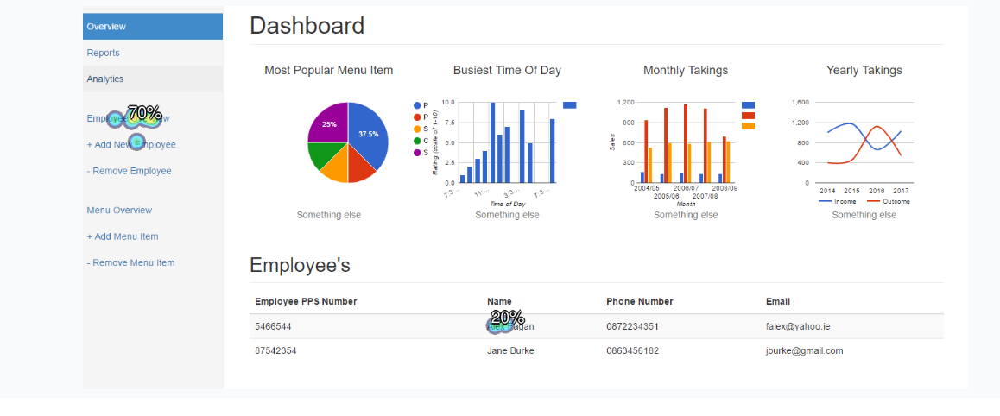
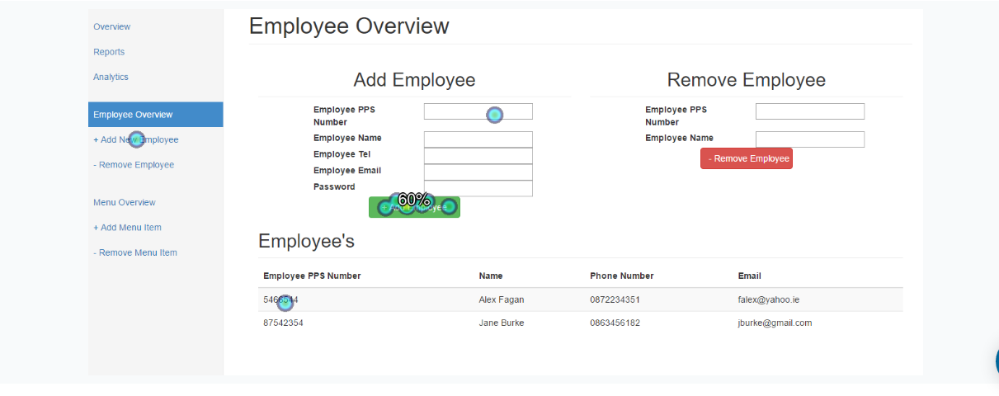

# POS App - Testing

Date:               
* 30th November 2016
 
Student Names:      
* Finnian O’Neill 
* Ian Kelly

Supervisor:           
* Dr.David Sinclair

Co-ordinator:           
* Dr.David Sinclair

##Table of Contents             
1. Unit Tests 
2. Instrumentation Tests
3. User Testing
4. Heuristic Evaluation
5. Cognitive Walkthrough
6. Known Bugs and Issues
7. Appendices

## 1. Unit Tests

## 2. Instrumentation Tests

### 2.1 Android Application 
#### Login Test
---------------------------------------------------------
***Test Name:*** successfulEmployeeLogin

***Test Summary:*** Login successfully as an Employee using valid login credentials

***Test Input:*** username: "johndoe@gmail.com" password: "password"

***Expected Result:*** Pass

***Actual Result:*** Pass

---------------------------------------------------------
***Test Name:*** successfulEmployerLogin

***Test Summary:*** Login successfully as an Employer using valid login credentials

***Test Input:*** username: "TestEmployer@gmail.com" password: "password"

***Expected Result:*** Pass

***Actual Result:*** Pass

---------------------------------------------------------
***Test Name:*** successfulEmployeeLoginCaptialLetters

***Test Summary:*** Login successfully as an Employee using valid login credentials in capital letters

***Test Input:*** username: "JOHNDOE@GMAIL.COM" password: "PASSWORD"

***Expected Result:*** Pass

***Actual Result:*** Fail

***Reason:*** Database is a linux machine and therefor is case sensitive.

---------------------------------------------------------
***Test Name:*** successfulEmployerLoginCaptialLetters

***Test Summary:*** Login successfully as an Employer using valid login credentials in capital letters

***Test Input:*** username: "TESTEMPLOYER@GMAIL.COM" password: "PASSWORD"

***Expected Result:*** Pass

***Actual Result:*** Fail

***Reason:*** Database is a linux machine and therefor is case sensitive.

---------------------------------------------------------
***Test Name:*** noUsername

***Test Summary:*** Attempt to login without providing a username, expect correct error message.

***Test Input:*** username: "" password: "password"

***Expected Result:*** Pass

***Actual Result:*** Pass

---------------------------------------------------------
***Test Name:*** noPassword

***Test Summary:*** Attempt to login without providing a password, expect 
correct error message.

***Test Input:*** username: "johndoe@gmail.com" password: ""

***Expected Result:*** Pass

***Actual Result:*** Pass

---------------------------------------------------------
***Test Name:*** wrongPassword

***Test Summary:*** Attempt to login using a valid but incorrect combination of username & password. Expect correct error message to be displayed

***Test Input:*** username: "johndoe@gmail.com" password: "password123"

***Expected Result:*** Fail

***Actual Result:*** Fail

***Reason:*** Correct error message is displayed but can't be read by Android Espresso as it is a toast message  

---------------------------------------------------------
***Test Name:*** wrongUsername

***Test Summary:*** Attempt to login using a valid but incorrect combination of username & password. 

***Test Input:*** username: "johndoe@gmail.commmm" password: "password"

***Expected Result:*** Fail

***Actual Result:*** Fail

***Reason:*** Correct error message is displayed but can't be read by Android Espresso as it is a toast message 

---------------------------------------------------------
***Test Name:*** correctButLongEmail

***Test Summary:*** Attempt to login using a valid username that is beyond the max character limit. 271 characters long. Expect correct error message.

***Test Input:*** username: "reallyreallyreallyreallyreallyreallyreallyreallyreallyreallyreallyreallyreallyreallyreallyreallyreallyreallyreallyreallyreallyreallyreallyreallyreallyreallyreallyreallyreallyreallyreallyreallyreallyreallyreallyreallyreallyreallyreallyreallyreallyreallylongemail@gmail.com" password: "password"

***Expected Result:*** Pass

***Actual Result:*** Pass

---------------------------------------------------------
***Test Name:*** correctButLongPassword

***Test Summary:*** Attempt to login using a valid password that is beyond the max character limit. Expect correct error message.

***Test Input:*** username: "longpassword@gmail.com" password: "reallyreallylongpassword1"

***Expected Result:*** Pass

***Actual Result:*** Pass

---------------------------------------------------------
***Test Name:*** correctNumberEmail

***Test Summary:*** Attempt to login using a valid email with numbers in it.

***Test Input:*** username: "123456789@gmail.com" password: "password"

***Expected Result:*** Pass

***Actual Result:*** Pass

---------------------------------------------------------
***Test Name:*** correctNumberPassword

***Test Summary:*** Attempt to login using a valid password with numbers in it.

***Test Input:*** username: "numberpassword@gmail.com" password: "123456789"

***Expected Result:*** Pass

***Actual Result:*** Pass

---------------------------------------------------------
***Test Name:*** correctSpecialCharEmail

***Test Summary:*** Attempt to login using a valid email with common special characters in it.

***Test Input:*** username: "++--**@gmail.com" password: "password"

***Expected Result:*** Pass

***Actual Result:*** Pass

---------------------------------------------------------
***Test Name:*** correctSpecialCharPassword

***Test Summary:*** Attempt to login using a valid password with common special characters in it.

***Test Input:*** username: "specialcharepassword@gmail.com" password: "++--**"

***Expected Result:*** Pass

***Actual Result:*** Pass

---------------------------------------------------------
***Test Name:*** afterSuccessfulLoginBackPressed

***Test Summary:*** Login succesfully, then press the back button and see if you are logged out.

***Test Input:*** username: "johndoe@gmail.com" password: "password"

***Expected Result:*** Fail

***Actual Result:*** Fail

***Reason:*** Remaining logged in was causing issues with the async tasks retrieving data from the server so you will be returned to the login page.

---------------------------------------------------------
***Findings from Android Application testing***
As a result of testing the login screen we now handle empty emails and passwords correctly and as a result now show the correct error message. We also handle the max length of passwords and emails correctly now too. 

### 2.2 Website 
#### Signup Test
---------------------------------------------------------
***Test Name:*** successfulCompanyEmployerSignUp

***Test Summary:*** Create an account successfully

***Test Input:*** Company Name: "Order 66" Company Address: "123 Abc Street, Alphabet Town, Letterland" Company tel: "12-3456789" Employer Name: "Joe Bloggs" Employer Tel: "12-3456789" Employer Email: "joebloggs@gmail.com" Employer Address: "123 Abc Street, Alphabet Town, Letterland" Employer Password: "password"

***Expected Result:*** Pass

***Actual Result:*** Pass

---------------------------------------------------------

***Test Name:*** noCompanyNameNoEmployerName

***Test Summary:*** Attempt to create an account without providing a username, expect correct error message.

***Test Input:*** Company Name: "" Company Address: "123 Abc Street, Alphabet Town, Letterland" Company tel: "12-3456789" Employer Name: "" Employer Tel: "12-3456789" Employer Email: "joebloggs@gmail.com" Employer Address: "123 Abc Street, Alphabet Town, Letterland" Employer Password: "password"

***Expected Result:*** Pass

***Actual Result:*** Pass

---------------------------------------------------------
***Test Name:*** noCompanyAddressNoEmployerAddress

***Test Summary:*** Attempt to create an account without providing an address, expect correct error message.

***Test Input:*** Company Name: "Order 66" Company Address: "" Company tel: "12-3456789" Employer Name: "Joe Bloggs" Employer Tel: "12-3456789" Employer Email: "joebloggs@gmail.com" Employer Address: "" Employer Password: "password"

***Expected Result:*** Pass

***Actual Result:*** Pass

---------------------------------------------------------
***Test Name:*** noCompanyTelNoEmployerTel

***Test Summary:*** Attempt to create an account without providing a telephone number, expect correct error message.

***Test Input:*** Company Name: "Order 66" Company Address: "123 Abc Street, Alphabet Town, Letterland" Company tel: "" Employer Name: "Joe Bloggs" Employer Tel: "" Employer Email: "joebloggs@gmail.com" Employer Address: "123 Abc Street, Alphabet Town, Letterland" Employer Password: "password"

***Expected Result:*** Pass

***Actual Result:*** Pass

---------------------------------------------------------

***Test Name:*** correctButLongEmail

***Test Summary:*** Attempt to create an account providing a email that is beyond the character limit, expect correct error message.

***Test Input:*** Company Name: "Order 66" Company Address: "123 Abc Street, Alphabet Town, Letterland" Company tel: "" Employer Name: "Joe Bloggs" Employer Tel: "" Employer Email: "reallyreallyreallyreallyreallyreallyreallyreallyreallyreallyreallyreallyreallyreallyreallyreallyreallyreallyreallyreallyreallyreallyreallyreallyreallyreallyreallyreallyreallyreallyreallyreallyreallyreallyreallyreallyreallyreallyreallyreallyreallyreallylongemail@gmail.com" Employer Address: "123 Abc Street, Alphabet Town, Letterland" Employer Password: "password"

***Expected Result:*** Pass

***Actual Result:*** Pass

---------------------------------------------------------

***Test Name:*** correctButLongPassword

***Test Summary:*** Attempt to create an account providing a password that is beyond the character limit, expect correct error message.

***Test Input:*** Company Name: "Order 66" Company Address: "123 Abc Street, Alphabet Town, Letterland" Company tel: "" Employer Name: "Joe Bloggs" Employer Tel: "" Employer Email: "joebloggs@gmail.com" Employer Address: "123 Abc Street, Alphabet Town, Letterland" Employer Password: "reallyreallylongpassword1"

***Expected Result:*** Pass

***Actual Result:*** Pass

---------------------------------------------------------

***Test Name:*** correctSpecialCharEmail

***Test Summary:*** Attempt to create an account using a valid email with common special characters in it.

***Test Input:*** Company Name: "Order 66" Company Address: "123 Abc Street, Alphabet Town, Letterland" Company tel: "" Employer Name: "Joe Bloggs" Employer Tel: "" Employer Email: "++--**@gmail.com" Employer Address: "123 Abc Street, Alphabet Town, Letterland" Employer Password: "password"

***Expected Result:*** Pass

***Actual Result:*** Pass

---------------------------------------------------------
***Test Name:*** correctSpecialCharPassword

***Test Summary:*** Attempt to create an account using a valid email with common special characters in it.

***Test Input:*** Company Name: "Order 66" Company Address: "123 Abc Street, Alphabet Town, Letterland" Company tel: "" Employer Name: "Joe Bloggs" Employer Tel: "" Employer Email: "joebloggs@gmail.com" Employer Address: "123 Abc Street, Alphabet Town, Letterland" Employer Password: "++--**"

***Expected Result:*** Pass

***Actual Result:*** Pass

---------------------------------------------------------
#### Login Test
---------------------------------------------------------
***Test Name:*** successfulEmployeeLogin

***Test Summary:*** Attempt to Login through the Employer login screen using Employee account credentials, error expected.

***Test Input:*** username: "johndoe@gmail.com" password: "password"

***Expected Result:*** Pass

***Actual Result:*** Pass

---------------------------------------------------------
***Test Name:*** successfulEmployerLogin

***Test Summary:*** Login successfully as an Employer using valid login credentials

***Test Input:*** username: "TestEmployer@gmail.com" password: "password"

***Expected Result:*** Pass

***Actual Result:*** Pass

---------------------------------------------------------
***Test Name:*** successfulEmployerLoginCaptialLetters

***Test Summary:*** Login successfully as an Employer using valid login credentials in capital letters

***Test Input:*** username: "TESTEMPLOYER@GMAIL.COM" password: "PASSWORD"

***Expected Result:*** Pass

***Actual Result:*** Fail

***Reason:*** Database is a linux machine and therefore is case sensitive.

---------------------------------------------------------
***Test Name:*** noUsername

***Test Summary:*** Attempt to login without providing a username, expect correct error message.

***Test Input:*** username: "" password: "password"

***Expected Result:*** Pass

***Actual Result:*** Pass

---------------------------------------------------------
***Test Name:*** noPassword

***Test Summary:*** Attempt to login without providing a password, expect 
correct error message.

***Test Input:*** username: "TestEmployer@gmail.com" password: ""

***Expected Result:*** Pass

***Actual Result:*** Pass

---------------------------------------------------------
***Test Name:*** wrongPassword

***Test Summary:*** Attempt to login using a valid but incorrect combination of username & password. Expect correct error message to be displayed

***Test Input:*** username: "TestEmployer@gmail.com" password: "password123"

***Expected Result:*** Pass

***Actual Result:*** Pass 

---------------------------------------------------------
***Test Name:*** wrongUsername

***Test Summary:*** Attempt to login using a valid but incorrect combination of username & password. 

***Test Input:*** username: "TestEmployer@gmail.commmm" password: "password"

***Expected Result:*** Pass

***Actual Result:*** Pass

---------------------------------------------------------
***Test Name:*** correctButLongEmail

***Test Summary:*** Attempt to login using a valid username that is beyond the max character limit. 271 characters long. Expect correct error message.

***Test Input:*** username: "reallyreallyreallyreallyreallyreallyreallyreallyreallyreallyreallyreallyreallyreallyreallyreallyreallyreallyreallyreallyreallyreallyreallyreallyreallyreallyreallyreallyreallyreallyreallyreallyreallyreallyreallyreallyreallyreallyreallyreallyreallyreallylongemail@gmail.com" password: "password"

***Expected Result:*** Pass

***Actual Result:*** Pass

---------------------------------------------------------
***Test Name:*** correctButLongPassword

***Test Summary:*** Attempt to login using a valid password that is beyond the max character limit. Expect correct error message.

***Test Input:*** username: "longpassword@gmail.com" password: "reallyreallylongpassword1"

***Expected Result:*** Pass

***Actual Result:*** Pass

---------------------------------------------------------

***Finding from Website testing***
As a result of both the signup and login testing, results shown above. We have discoverd a possible security risk. Although we don't allow users to create accounts with passwords greater than 25 characters long and all other text fields greater than 255 characters long. We never put a maxlength on the login screen on the website and as such, there is potential for mallicous code to be injected there.

## 3. User Testing

***User test results are the averages taken from 10 seperate users. Task difficulty is on a scale of 1-10 with 10 being very hard.***

#### Task One: Add a single item to an order and send it.

***Completion Rate:*** 

100%

***Usability Problems:*** 

Too many steps, no indication of green button functions.

***Task Time :*** 

32.2 seconds

***Test Level Difficulty:*** 

4

***Expected difficulty:*** 

1

***Errors:*** 

Only 60% pressed the green shortcut button to get to the order list. Many got stuck and added a second order item. No clear indication on how to get to order list.

***Overall Relative Effeciencey:*** 

100%

#### Task Two: View the received order list and delete an order.

***Completion Rate:*** 

100%

***Usability Problems:*** 

Received list names confusing. Stuck at green delete button, only solved with knowledge from previous task.

***Task Time :*** 

27 seconds

***Test Level Difficulty:*** 

2

***Expected Difficulty:*** 

5

***Errors:*** 

Pausing at 'View total orders' button. Stuck at order names.

***Overall Relative Effeciencey:***

100%

## 4. App Heuristic Evaluation

#### 1. Visibility of system status
All buttons in the app will change colour to a darker grey to indicate to the user when they have been pressed. When an order is sent, a small message will appear in the centre of the screen saying "Your order has been sent!" to inform the user. There is also another message saying "Item added to order" that appears after an item is added to the order. However, a bug is preventing it from showing.
 
#### 2. Match between system and the real world
All of the language in the app are named appropriately after how they are referred to in the real world. All of the buttons in the app have a symbol on them to indicate their function such as a tick symbol to indicate an order is finished. However, some of the symbols are ambiguous enough to make the user hesitate to press them.
 
#### 3. User control and freedom
The app is linear enough to support returning to the main menu or sidebar in the event that the user goes into the wrong page. the menu detail page also contains a button in the top left hand side of the screen to go back to the menu list. The app does not however facilitate the removal of an item from the order in the event that an incorrect order item is added.
 
#### 4. Consistency and standards
The naming of the app's pages are consistent throughout. Pressing 'Create an order' on the main page or in the sidebar takes you to the same page. There is one outlier to this, the 'View all open orders' button id renamed as 'Received orders' in the sidebar. The green buttons' location remains the same throughout the app. It can be found in the bottom right in the list pages and in the centre-right in the detail pages. The buttons are bright green to remain visible.
 
#### 5. Error prevention
The app's functions are relatively simple and therefore the user creating errors that are not already known bugs is unlikely to occur. Mistakes such as sending an incorrect order can be easily solved by removing that order from the open orders list and creating a new one. Errors on the login screen are prevented with an error message.
 
#### 6. Recognition rather than recall
All buttons are clearly visible in the centre of the screen or highlighted in a bright green colour if they are at the edge of the screen. Every list is clearly laid out and lists such as the table list in numerical order and the received orders list has orders in descending order of time created.
 
#### 7. Flexibility and efficiency of use
The green button in the lower right hand corner of the menu list is a shortcut to the order list. This reduces time spent on backing all the way to the main menu. There is a sidebar for fast navigation throughout the app which speeds up order creation time.

#### 8. Aesthetic and minimalist design
The app has a very minimalistic design. The colour scheme is simple, with the use of purple, white, and grey to avoid visual clutter while also making important buttons stand out in green to the user. All text in the app in only one word or a very short sentence to keep it concise while also clearly indicating the function of each button. The received order list is aesthetically unpleasant and can cause some confusion.
 
#### 9. Help users recognize, diagnose, and recover from errors
The only place that require error messages in the app is the login screen. Clear error messages are provided for when the user enters the wrong information into both the email and password boxes.
 
#### 10. Help and documentation
The app is too linear to require documentation. Adding another section for documentation may add unecessary clutter.

## 5. Cognitive Walkthrough

#### User

* College student in his late teens.
* Working part time on the weekends for extra money.
* Busy day at the restaurant, is a little stressed and tired.
* Comfortable with android phones. Moderately tech savvy.

#### Goal

* To order a Caesar salad for a customer.

#### Optimum task structure

* Log in -> Select Table -> Select Salad -> Add Salad To Order -> Shortcut To Order -> Send Order

***Task One: Log In***

The user loads into the app and is faced with the login screen, they notice the screen contains a box labelled 'menu' and another labelled 'password'. They are familiar with login screens and enter the email address and password they were given when they began working at the restaurant.

***Task Two: Select Table***

The user loads into the table list screen and without confusing knows that each table number represents the tables in the restaurant. They select the correct table for the order.

***Task Three: Select Salad***

Like the table list, there is little ambiguity in the menu list. The user selects the item that says 'Caesar Salad'.

***Task Four: Select Salad***

The user is taken to the menu detail screen, they read the price and description of the salad. They notice a green button on the right hand side and assume that that button is to add it to the menu. They press the button and are sent back to the menu list. There was no indication that the salad was added to the order so they go and check the order. 

***Task Five: Shortcut To Order***

The user is unaware that the green button in the bottom right hand corner of the menu is a shortcut to the order so they instead back all the way to the main menu. They notice the sidebar in the top left and corner and open it. The select total order and are sent to the order page.

***Task Six: Send Order***

On the order page, the user notices another green button in the lower right sand side of the screen with a tick on it. Assuming it has a similar function to the other green buttons on the app, they think that it will send the app. They press the button and a small message at the botton of the screen pops up to notify them that their order has been sent.

#### User task structure

* Log in -> Select Table -> Select Salad -> Add Salad To Order -> Back To Table List -> Back To Main Menu  -> Open Sidebar -> Select Total Order -> Send Order

## 6. Known Bugs and Issues

### 6.1 Android Application Bugs and Issues
1. An internet connection is required to use the app, could be solved by >>>>>>
2. If you have a connection and input the wrong username or password, it will print the "Oops! Something went wrong, check your connection" instead of printing the correct "Incorrect username or password".
3. The price, table number and Person who created the order are not being sent or stored in the database with the current version of the application due to time constraints and as a result the price of each order, the table number the order came from and who sent the order are not accessable in received orders.
4. When in the Item detail view, it will only display the first 15 characters of a menu item, pending the size of your device.
5. If you rotate the screen, the Item name will revert back to the default "Food Description".
6. When you add multiple orders in a session, the Menu item number to the left of the menu item name, when on the total/current order will keep increasing and not reset correctly until the application is closed or you log out.
7.  After sending an order, to get back to the home screen to be able to view the received orders, you have to press back multiple times to go back through the total order,then menu, then table list, then back to the home screen.
8.  Received orders currently only display the order number, which is a string representation of dd/mm/yyyy/hh/mm/ss as a result of Bug 3, mentioned above.
9.  When you press the remove/complete order button, it doesn't yet return you to the list of received orders
10.  There is no check or login status for accounts which means you can login on all devices using one account. 
11. Pressing the back button in the top left while in menu details send you back to the table list instead of the menu list. Pressing back on your phone sends you back to the main menu.
12. Viewing received orders may inexplicably cause the app to crash.
13. Having the app push you back to the menu list after adding an item to the order prevents the "Item added to order!" message from appearing.

### 6.2 Website Bugs and Issues
1. When using the website on a mobile device and you press the menu button to drop down the navbar, it pushes down the Text.
2. When logging in on a mobile device, the close button for the login modal is pushed to a new line.
3. On a mobile device, the sidebar on the employer admin page won't display.
4. If you try to remove an employee and input either the wrong PPS number or wrong name, it won't give an error message and nothing will happen, this is also the case for removing a menu item. 
5. Item price will accept a string.

## 7. Website First Click Heatmaps

These are heatmaps of the first clicks by 10 users when given specifics tasks.

Going to the sign up page.

Going to the employee details page.

Adding an employee page.

## 8. Appendices

