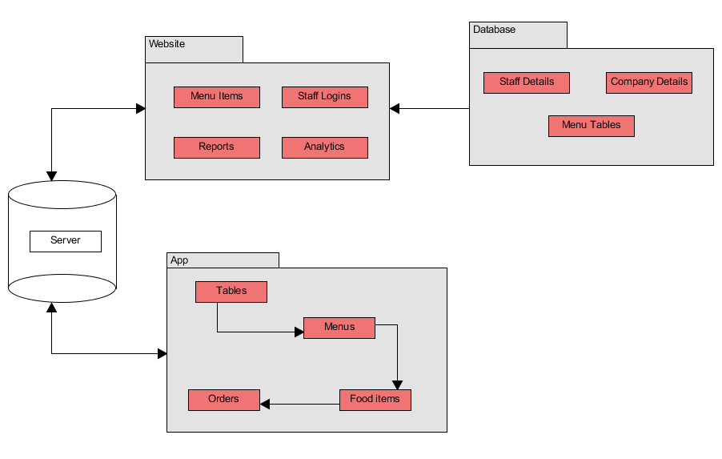
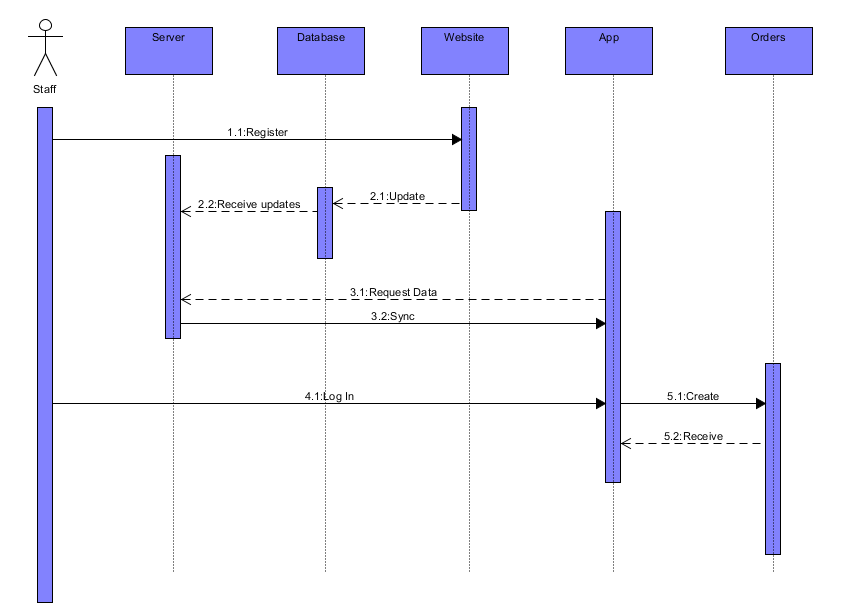
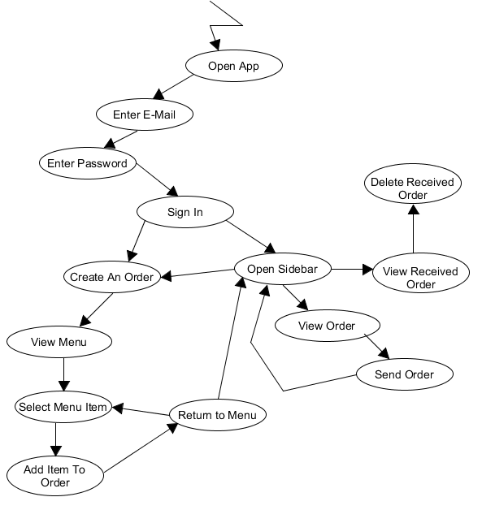
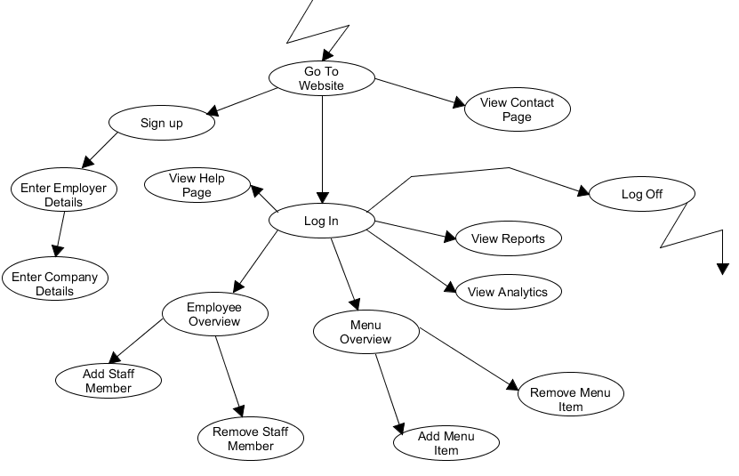
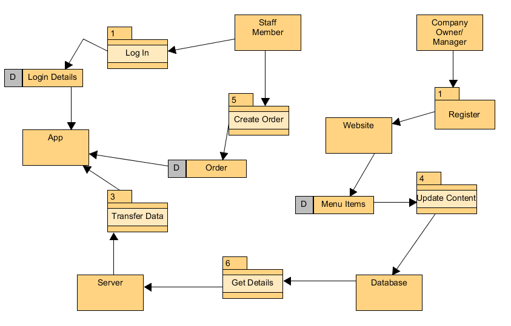

# POS App Technical Manual

Date:               
* 30th November 2016
 
Student Names:      
* Finnian O’Neill 
* Ian Kelly

Supervisor:           
* Dr.David Sinclair

Co-coordinator:
* Dr.David Sinclair

## Table of Contents             
1. Introduction. 
2. System Architecture 
3. High-Level Design 
4. Problems and Resolution
5. Installation Guide
6. Appendices

We declare that this material, which We now submit for assessment, is entirely our own work and has not been taken from the work of others, save and to the extent that such work has been cited and acknowledged within the text of my/our work. We understand that plagiarism, collusion, and copying are grave and serious offences in the university and accept the penalties that would be imposed should we engage in plagiarism, collusion or copying. We have read and understood the Assignment Regulations. We have identified and included the source of all facts, ideas, opinions, and viewpoints of others in the assignment references. Direct quotations from books, journal articles, Internet sources, module text, or any other source whatsoever are acknowledged and the source cited are identified in the assignment references. This assignment, or any part of it, has not been previously submitted by us or any other person for assessment on this or any other course of study. We have read and understood the referencing guidelines found at: http://www.dcu.ie/info/regulations/plagiarism.shtml 

-------------------------------------------------------------------------------

## Introduction

### Overview 
For our Third Year Project we decided to design a POS Application, which we called Order 66. Order 66 is an application aimed at restaurants, bars and cafes that will accompany and in the future replace your current till system. Order 66 uses a Website admin interface which will allow an employer create the menu for their restaurant/bar/cafe, add all the employee details so they can easily manage their accounts, automatically create reports, and lastly have access to helpful usage statistics. Employees can also download our Android Application which will allow employees to create orders using the menu their employer has created and send orders so all other employees can view them and start preparing them seconds after it has been sent.

Order 66 has many benefits for both the employer and the employee as it can help improve efficiency in the workplace which can in turn can provide greater returns for the employer. Not to mention making the employees life that much easier as they will not have to worry about forgetting what was in each order, what order went to what table and notify coworkers about the last order. 

### Business Context

The aim for this project is to provide an alternative option for current POS services with something that is tailored to the needs of your business allowing for a more efficient and productive service which in turn should increase sales.

The app will also have great scope for analytics and will allow the owner to determine where the inefficiencies lie in their business.

### Glossary

*POS App* - Point Of Sale Application
*WiFi P2P* - WiFi Peer to Peer

## Operational Scenarios

##### Registering on the Website. 

***Precondition*** --- The company is not registered on the Website. 

***Activation*** --- The company wants to sign up on the Website.

***Description :***  
* The company owner/ manager goes to the Website.
* They press the 'Get Started' or 'Sign Up' buttons.
* They enter the company details.
* They enter the employer's details.
* They click 'Submit' when finished.

***Termination*** --- The company is successfully registered to the Website.

##### Adding an employee to the Website. 

***Precondition*** --- The employee is not registered on the Website. 

***Activation*** --- A new employee has started working at the restaurant.

***Description :***  
* The company owner/manager goes to the Website.
* They sign into the company account.
* They click 'Add New Employee' on the left.
* They enter the employee's details.
* They click the green '+ Add Employee' button when finished.

***Termination*** --- The employee is successfully registered to the Website.

##### Removing an employee from the Website. 

***Precondition*** --- The employee is already registered on the Website. 

***Activation*** --- An existing employee has finished working at the restaurant.

***Description :***  
* The company owner/manager goes to the Website.
* They sign into the company account.
* They click 'Remove Employee' on the left.
* They enter the employee's PPS number and name.
* They click the red '- Add Employee' button when finished.

***Termination*** --- The employee is successfully removed from the Website.

##### Adding a new menu item. 

***Precondition*** --- The menu item is not registered on the Website. 

***Activation*** --- A new item is being added to the menu.

***Description :***  
* The company owner/manager goes to the Website.
* They sign into the company account.
* They click 'Add Menu Item' on the left.
* They enter the item's name, description, and price
* The select an item category.
* They click the green '+ Add Employee' button when finished.

***Termination*** --- The item is successfully added to the menu.

##### Removing a menu item. 

***Precondition*** --- The item is already on the menu. 

***Activation*** --- The manager/owner wants to remove a menu item.

***Description :***  
* The company owner/manager goes to the Website.
* They sign into the company account.
* They click 'Remove Employee' on the left.
* They enter the item's name, and price
* The select an item category.
* They click the red '- Remove Menu Item' button when finished.

***Termination*** --- The item is successfully removed from the menu.

##### Signing in to the app. 

***Precondition*** --- The staff member has not signed into the app. 

***Activation*** --- The user opens the app.

***Description :***  
* The staff member selects the email box.
* They enter in an email address.
* The staff member selects the password box.
* They enter in a password.
* They press the 'Sign In' button.

***Termination*** --- The staff member has logged into the app.

##### Creating an order 

***Precondition*** --- The staff member has not already made an order. 

***Activation*** --- A customer has decided to order a meal.

***Description :***  

* The staff member presses the 'Create an order' button on the main menu or in the sidebar.
* They select the table that the customer is sitting at.
* They select a food item.
* They staff member presses the green button to add the item to the order.
* They are automatically returned to the menu screen.
* They press the green button in the bottom-right of the screen.
* The user is sent to the order screen.
* The staff member presses the button in the bottom-right to send the order.

***Termination*** --- The order has been sent.

##### Receiving an order 

***Precondition*** --- The staff member has not received an order.

***Activation*** --- Another staff member has created and sent an order. 

***Description :***

* The The staff member presses the 'View all Open Orders' button on the main menu or in the sidebar.
* They select an order that they have received.
* They complete the order.
* Once completed, the staff member presses the green button to the delete the order.

***Termination*** --- The order has been deleted. 

## System Architecture

For this project we used a library called Boostrap to design our Website as the framework help making the process of creating a responsive Website much simpler as it uses the Grid System over the more traditional Box Model. 
[Bootstrap](http://getbootstrap.com/)

Another library we used was Google's Chart library to create all the different graphs and charts as it is a very well documented library that is easy to use.
[Google Charts](https://developers.google.com/chart/)

The Entity-Relationship Diagram below outlines our implemented database design, it also shows the Primary and Foreign keys in each table. 

The following diagram gives a brief overview of the systems involved in the project.

This sequence diagram highlights the flow between objects in the project.

## High-Level Design

Our android application requires an Internet connection to function as it uses HTTP POST requests to run PHP scrips on a server. Each script then uses SQL querys to query our SQL Database which store all of our user information and insert or pull any required information, which then updates on the users Android Device. Our Admin interface on our Website uses a combination of HTML5, CSS3, JS and PHP to allow an Employer to see a list of all of the employees, create/remove employee accounts, create/add Menu Items and view charts and stats unique to their business. All passwords are Hashed before they are stored on the database using PHP, so both the hash and unique salt are stored on the database.

This business activity model visualises the steps taken by the company staff when using the app.

This business activity model visualises the steps taken by the company owner or manager when using the Website.

This data flow diagram highlights the flow of data through the project, as well as showing an overview of the process involved.

## Problems and Resolution

### WiFi P2P

After our initial design and research we intended to use android's native WiFi P2P library, that would allow us to be able to send data between two devices that are connected by a Local Area Network, this can also be achieved by using a mobile devices ability to create a hotspot, which would act as the Local Area Network. The issues we encountered was that the WiFi P2P library is a recent addition to the android framework and was previously called Android Beam meaning that only devices from API level 14 or higher would be capable of using the service. 

Another issue we came across was that the P2P services acts similarly to a bluetooth connection as it uses WPS for security and as a result needs the user to hit accept for each file transfer.

Another significant issue was that once two devices were connected, one device would become the group owner and would act as the server while the rest would act as clients. The problem was that the group owner was only able to receive files and to become the group owner, you would have to disconnect and reconnect, meaning the user would have to accept the connection again which wasn't practical as if a waitress wanted to send an order to the kitchen, she could but then to get any updates on the status of the order, the waitress would have to accept the connection from the kitchen each time they wanted to change the order status. 

Lastly disconnecting from a group was not very consistent as the group was only destroyed after the group owner disconnected and the connection timeout was reached. This meant that users would may have tried to disconnect to an empty group while the other user may create a new group or their Status would change from available to either busy and wouldn't be able to be found by the searching devices.

Our solution to these issues was to try an alternative method, which resulted in the application requiring an Internet connection to be able to function. We used the HTTP POST request to run PHP files on a server that would handle accessing and storing all our data on a MYSQL Server. 

### General App Functionality Problems

***Navigation problem*** --- Near the start of creating the app layout we had significant issues with navigating the layout of the app. This was initially solved by using two of the default android activities together. The 'master/detail flow ' and 'navigation drawer' together to solve this. This allowed us to set up a menu list and its details and have a navigation drawer for later pages. However this brought with it the use of fragments and recycler view adapters which, at the time, proved difficult to understand and made finding out what each of the classes and how they interacted challenging. The fragments became easier to follow after significant time studying the android API and numerous online tutorials. This in turn allowed us to create more fragments and activities for pages such as the table list and the order pages.

***Adding items to an order*** --- With the addition of new fragments and activities for tables lists and for the order, a new problem was how to add items to an empty order. This was solved by creating new content lists which created new list items to add an item and referencing them in the menu list and detail activities.
When a menu item is clicked, the name of that item is saved as a string. When the Add Item button is clicked in the menu detail fragments, a new order item is created with the name in the string and set at the correct position.

***Received orders*** --- One of the last issues we had was creating order details and including a function to remove orders from the received orders list. The order details were solved by creating new layouts, separate from the menu detail layouts, for the order details and calling them instead. The remove order problem was solved by calling another Async task that runs in the background which calls the server. The server then changes the status of the order form open to close and then notifies the app.

## Known, Unresolved Bugs

### Android Application
1. An Internet connection is required to use the app, could be solved by using hotspots and caching menu items, but it requires an Internet connection to update cache.
2. If you have a connection and input the wrong username or password, it will print the "Oops! Something went wrong, check your connection" instead of printing the correct "Incorrect username or password".
3. The price, table number and Person who created the order are not being sent or stored in the database with the current version of the application due to time constraints and as a result the price of each order, the table number the order came from and who sent the order are not accessible in received orders.
4. When in the Item detail view, it will only display the first 15 characters of a menu item, pending the size of your device.
5. If you rotate the screen, the Item name will revert back to the default "Food Description".
6. When you add multiple orders in a session, the Menu item number to the left of the menu item name, when on the total/current order will keep increasing and not reset correctly until the application is closed or you log out.
7.  After sending an order, to get back to the home screen to be able to view the received orders, you have to press back multiple times to go back through the total order,then menu, then table list, then back to the home screen.
8.  Received orders currently only display the order number, which is a string representation of dd/mm/yyyy/hh/mm/ss as a result of Bug 3, mentioned above.
9.  When you press the remove/complete order button, it doesn't yet return you to the list of received orders
10.  There is no check or login status for accounts which means you can login on all devices using one account. 
11. Pressing the back button in the top left while in menu details send you back to the table list instead of the menu list. Pressing back on your phone sends you back to the main menu.
12. Viewing received orders may inexplicably cause the app to crash.

### Website
1. When using the Website on a mobile device and you press the menu button to drop down the navbar, it pushes down the Text.
2. When logging in on a mobile device, the close button for the login modal is pushed to a new line.
3. On a mobile device, the sidebar on the employer admin page won't display.
4. If you try to remove an employee and input either the wrong PPS number or wrong name, it won't give an error message and nothing will happen, this is also the case for removing a menu item. 
5. Item price will accept a string.

## Installation Guide

### Required Software/Hardware
* Android Studio
* Order66 Project Files
* Android Device
* USB Cable

As our application is not on the Google Play Store, you will have to install it through Android Studio and run it through your device that way. To do so, follow these steps.

#### Step 1
##### Employer Setup
Order 66 requires a signup process through our Website which will allow you to create your menu and different accounts for your employee.

1. Go to [order66.finnianoneill.ie](http://www.order66.finnianoneill.ie).
2. Press the Sign Up button in the top left hand side of your screen.
3. Fill out the form accordingly.
4. After filling out the form, you will be brought to your Dashboard, on the sidebar on the lefthand side of the screen, press "+ Add Menu Item"
5. Here you can add all your menu items and some useful statistics once you get using Order 66.
6. Lastly you can add some employee accounts, by pressing "+ Add Employee" and filling out the small form. 

#### Step 2
##### Android Studio Installation
1. Go to [developer.android.com](https://developer.android.com/studio/index.html) and download the Android Studio .exe file.
2. Once it's finished downloading, launch the .exe file you downloaded.
3. Follow the setup wizard to install Android Studio and you can leave all the settings as default. A video can be found at [this link](https://developer.android.com/studio/install.html)

#### Step 3
##### Order 66 Project Files
1. Go to the [Order 66 Website](http://www.order66.finnianoneill.ie)
2. On the homepage below the Heading text there is a button that says "Download Order 66" 

#### Step 4
##### Installing Order 66 onto your device
1. Once you have downloaded Order66.zip, unzip it and open Android Studio.
2. When Android Studio opens choose "open existing project" and navigate to Order66.
3. When it opens, press the green play button at the top of the screen seen here 
4. Then connect your Android device to your computer using your USB cable and it should appear on the menu.
5. Then select your device as the deployment target.
6. Allow the computer time to build and install the application, and once you see it open, you can press the red stop button.
7. Disconnect your device and Order 66 will be still installed. All your Menu Items will be available once you login.

## Appendices