# Order 66 - User Manual

This user manual is aimed to help you get started using Order 66. It will have detailed descriptions of the following:

## Contents
1. Employer Registration
2. Setting up a Menu
3. Creating Employee Accounts
4. Android Studio Installation
5. Order 66 Project Files
6. Installing Order 66 onto your device
7. Getting Started with Order 66 on Android
8. Creating Orders
9. Sending Orders & Receiving Orders
10. Logging Out
11. Syncing

## Getting Started

You will need the following to be able to get started using Order 66 for the first time:

* An Internet connection is required to use this application.
* An Android Device
* A USB Cable

## 1. Employer Registration
1. Go to [order66.finnianoneill.ie](http://www.order66.finnianoneill.ie).
2. Press the "Sign Up" button in the top left hand side of your screen. 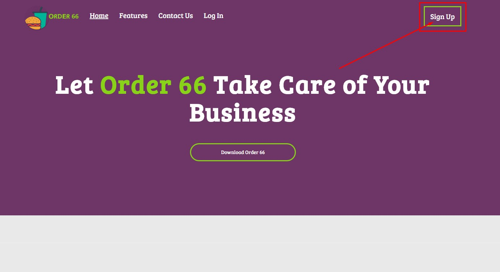.
3. Scroll down the page and you will find the Company and Employer registration form.
4. Fill out the form accordingly. 
5. 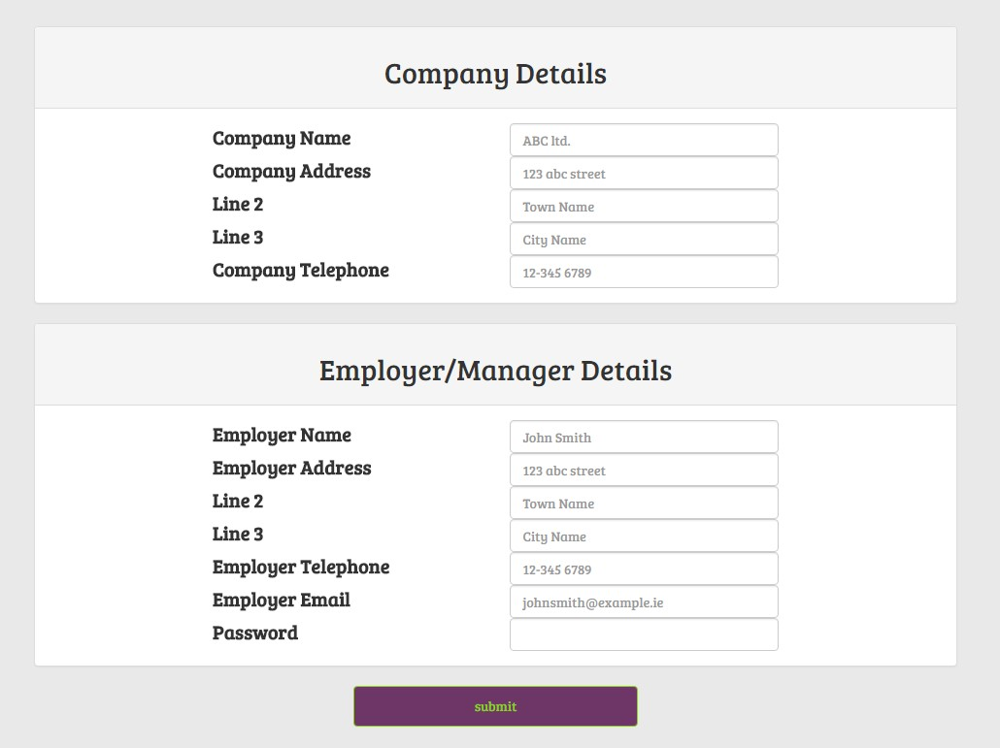
6. Remember that your password must be between 8-25 characters long, and it is good practice to use a combination of upper case characters, lower case characters and special characters to create a strong password.
7. When you're finished, you can press the submit button to proceed.

## 2. Setting up a Menu
1. After filling out the form, you will be brought to your Dashboard.This Dashboard will be your home screen where you can view all your employee details at a glance and some useful statistics.
2. On the sidebar on the left hand side of the screen, press "+ Add Menu Item" 
4. 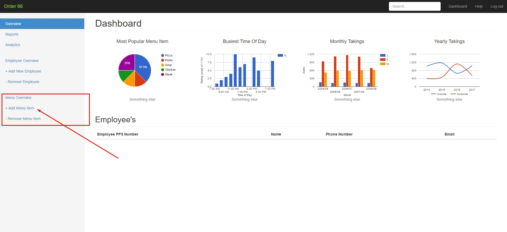.
5. This will bring you to your Menu Overview. Here you can add all your menu items and see some useful statistics once you get using Order 66 
6. 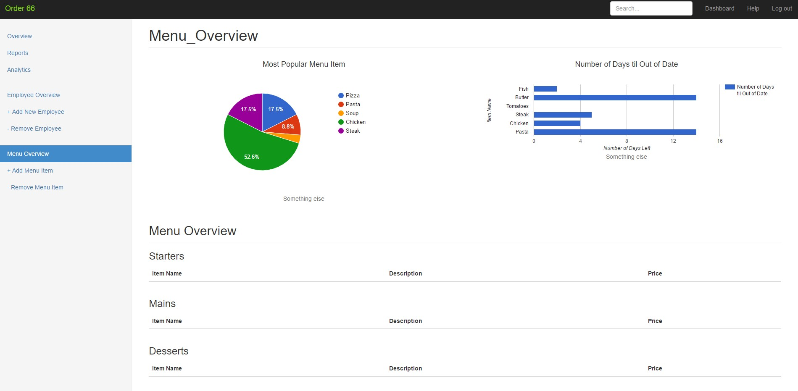.
7. When you reach the Menu Overview, scroll to the bottom of the page, or press the "+ Add Menu Item" again to bring you to the Add and Remove Menu Item Form 
8. You can fill out the form for each menu item and they will begin to appear on the lists above the form. 
9. 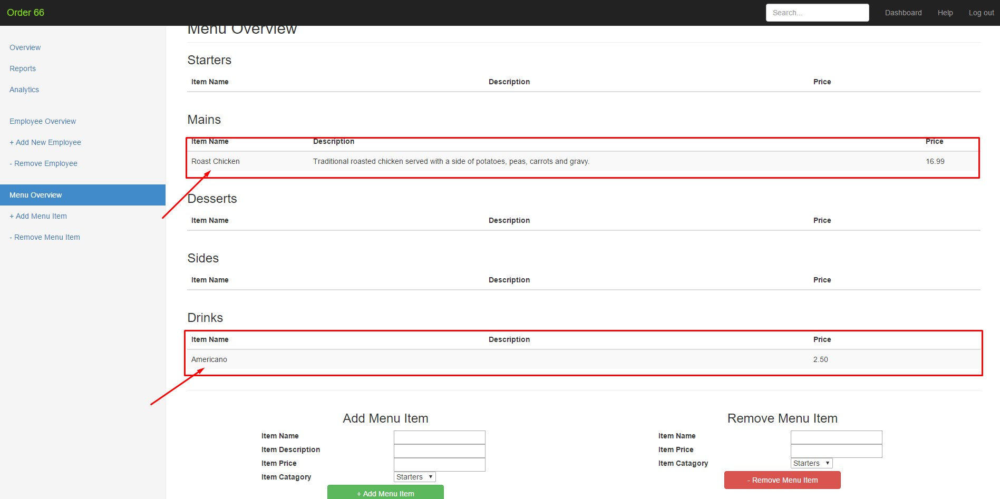

## 3. Creating Employee Accounts
1. To being adding Employee Accounts, click the "+ Add New Employee" button on the side on the left side of your screen.
2. 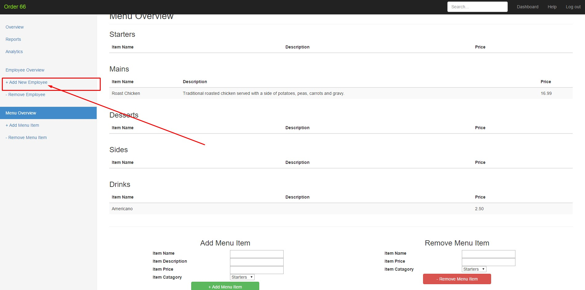
3. This will bring you to your Employee Overview, where you can add and remove Employee accounts .
4. 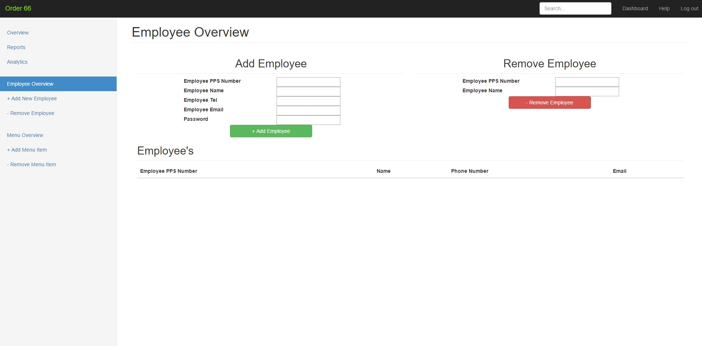 
5. At the top of the screen you will find the "Add Employee" form where you can begin to creating user accounts for your employees. These accounts will allow your employee to login using the Android Application. 
6. 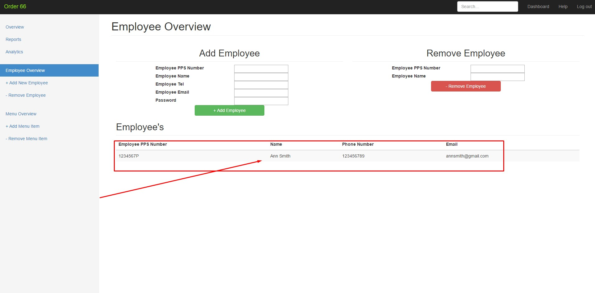.
7. Once all your Employee accounts are setup, you're ready to start downloading Android Studio.

## 4. Android Studio Installation
1. Go to [developer.android.com](https://developer.android.com/studio/index.html) and download the Android Studio .exe file 
2. 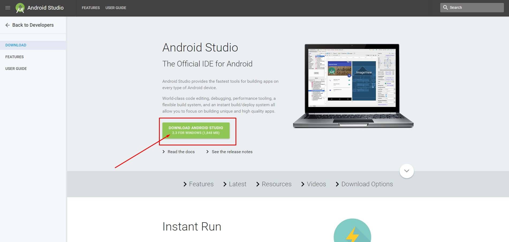.
3. Once it's finished downloading, launch the .exe file you downloaded.
3. Follow the setup wizard to install Android Studio and you can leave all the settings as default. A video can be found at [this link](https://developer.android.com/studio/install.html)

## 5. Order 66 Project Files
1. Go to the [Order 66 Website](http://www.order66.finnianoneill.ie)
2. On the homepage below the Heading text there is a button that says "Download Order 66" .
3. 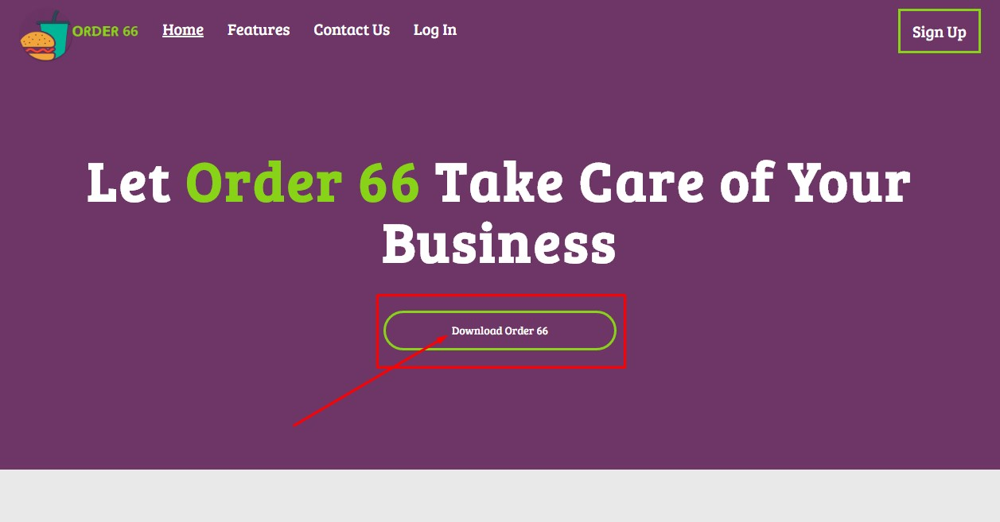

## 6. Installing Order 66 onto your device
1. Once you have downloaded Order66.zip, unzip it and open Android Studio.
2. When Android Studio opens choose "open existing project" and navigate to Order66.
3. When it opens, press the green play button at the top of the screen seen here 
4. 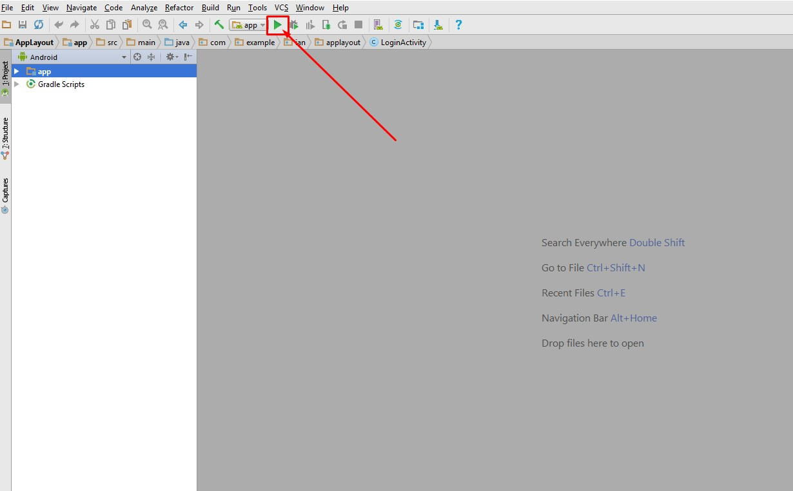
4. Then connect your Android device to your computer using your USB cable and it should appear on the menu.
5. Then select your device as the deployment target 
6. 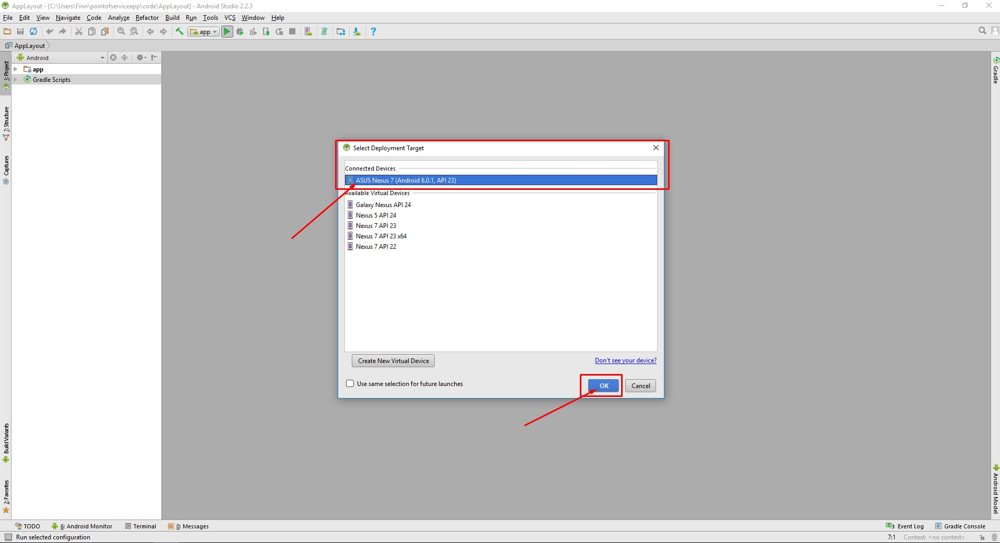.
7. Allow the computer time to build and install the application, and once you see it open, you can press the red stop button 
8. 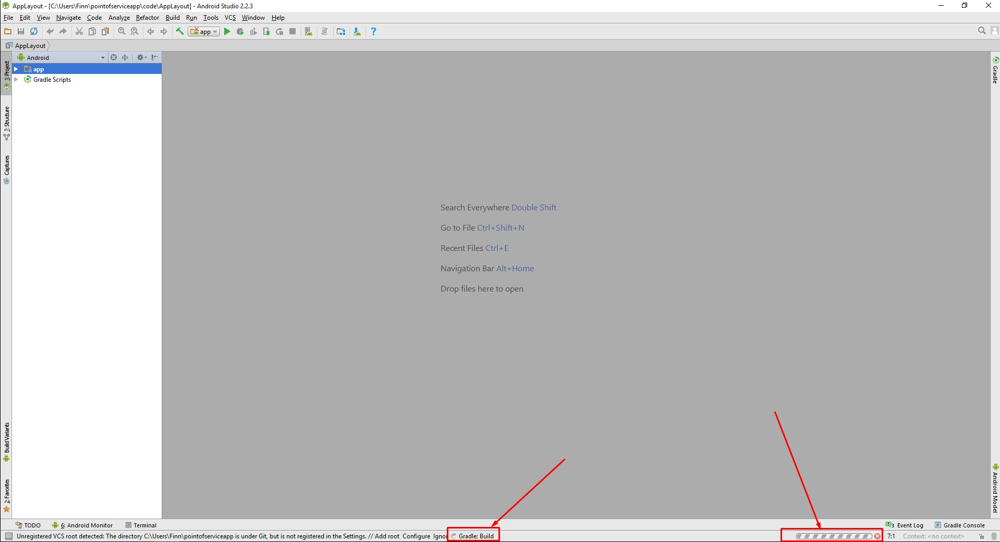.
7. Disconnect your device and Order 66 will be still installed. All your Menu Items will be available once you login.

## 7. Getting Started with Order 66 on Android
1. Now that you have the Order 66 Application downloaded,open it on your device and you will presented with a splash screen.
2. After a brief delay, a login screen will appear.
3. You can login using your Employer login or the Employee account details that has been given to you by your employer.
4.  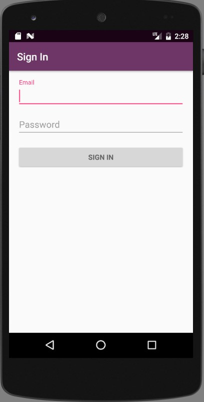

## 8. Creating Orders
1. Once you have successfully logged in, to begin creating orders, press the large "Create An Order" button, or use the "+ Create Order" button in the menu.
2. Then select the table number you want to create an order for.
3. This brings you to the menu list that your Employer created earlier.
4. Tap Menu Items to select, then tap the green "+" button in the detailed view.
5. 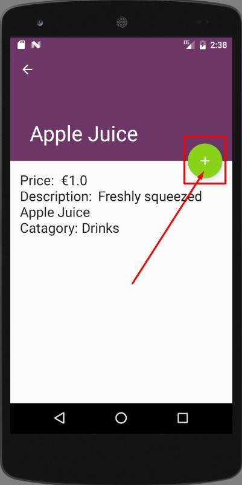;

## 9. Sending Orders & Receiving Orders
1. To view your order so far press the green square button on the bottom left of the screen. 
2. 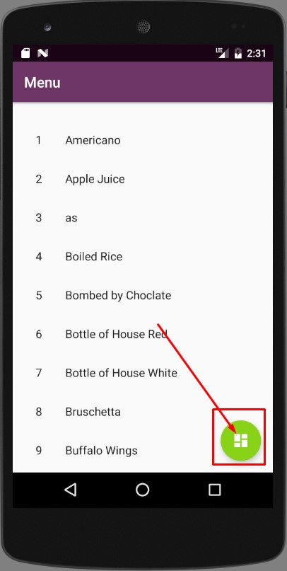
3. To send your order then press the green tick button on the bottom left of the total order so far screen. 
4. Lastly to view all your incoming orders, use the back button to navigate to the home menu.
5. In the Menu list, 

## 10. Logging Out & Syncing
1. To log out, return to the Home screen with the large "Create Order" button and the "View All OPEN Orders" button.
2. At the top of the screen, press the button with the three dots icon.
3. There you will find the log out button which will return you to the login screen.
4. Also in that menu, you will find the sync button which will force a refresh of the Menu and check for any newly received Orders.
5. 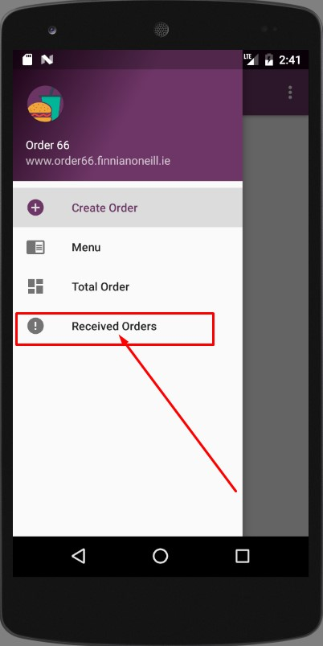

